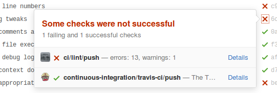

This is a GitHub integration powered by Travis-CI

[Why](#why)
[Limitations](#limitations)
[Setup](#setup)
[Notes](#notes)
[In The Wild](#in-the-wild)

## Why
I wanted to separate Linter results from Test results. 
I don't believe that continuous integration should fail because 
of simple linting errors. 
This module is meant to post Linter results as a separate Status 
line on a GitHub commit or Pull Request.



## Limitations
This module assumes you are working with Travis for CI, 
GitHub for SCM, and ESLint for linting. 
Pull requests welcome to extend support.

When linting, the module acts the same as if you called `eslint .` 
in your project root.

## Setup
First you will need to create a [Personal Access Token][0] with 
the *repo:status* permission. 
Add your generated token to your repository's Environment Varibles 
in Travis-CI as `TRAVIS_GITHUB_LINT_STATUS_TOKEN`. 
You can access the Environment Variables in Travis-CI by going 
to your repository's Settings page on the Travis-CI website.

Next you will need to load this module during your Travis-CI execution. 
In your _install_ section add `npm install travis-github-lint-status`. 
If you don't have an _install_ section, you will need to add one 
(example in YAML):
```
install:
  - npm install;
    npm install travis-github-lint-status;
```

Then the actual call in the _script_ section 
(again in YAML, replace `npm run coverage` with whatever your 
standard CI run script is):
```
script:
  - ./node_modules/travis-github-lint-status/index.js
    npm run coverage;
```

## Notes
This module should only be run once per commit or pull-request.
If your CI is configured to test on multiple platforms or Node versions, 
you should make sure this module only runs in one particular configuration.

An example:
```
language: node_js
node_js:
  - "node"
  - "4"
  - "0.12"
os:
  - linux
  - osx
install:
  - npm install;
    npm install travis-github-lint-status;
script:
  - if [ "$TRAVIS_OS_NAME" == "linux" ] && [ "$TRAVIS_NODE_VERSION" == "node" ]; then
    ./node_modules/travis-github-lint-status/index.js;
    fi;
    npm run coverage;
```

## In The Wild
Feel free to explore the pull requests, commit Statuses, and Travis-CI configs
of the following projects:

* [Spacebrew][1]


[0]: https://github.com/settings/tokens
[1]: https://github.com/quinkennedy/spacebrew
